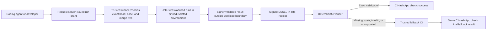
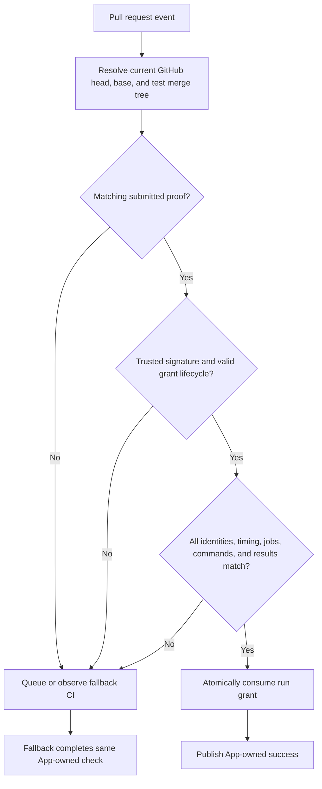
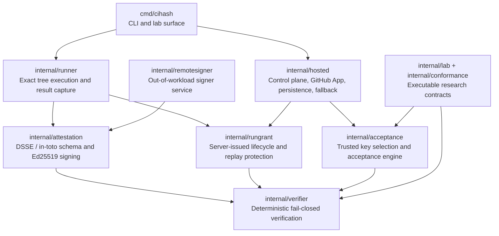
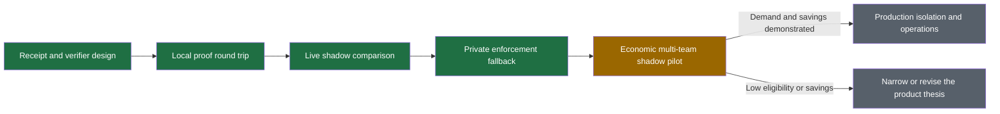

<div align="center">

# CIHash

**Run trusted verification once. Reuse the signed result for the exact code, policy, and environment, or fall back to ordinary CI.**

CIHash is a proof-carrying CI prototype for coding-agent workflows. It turns an isolated, policy-approved pre-push run into a signed GitHub check decision without weakening the repository's existing CI safety net.

[](https://github.com/wolfiesch/cihash/actions/workflows/ci.yml)


[](LICENSE)

</div>

> [!IMPORTANT]
> CIHash is an experimental reference implementation. It has demonstrated the end-to-end proof and fallback path in private sandboxes, but it has not yet established production isolation, broad workflow compatibility, market demand, or favorable unit economics.

## At a glance

| | Current state |
|---|---|
| **Product stage** | End-to-end prototype; technical feasibility demonstrated, external demand unproven |
| **Core decision** | Accept an exact trusted proof immediately, otherwise route to ordinary CI |
| **Initial user** | A team with agent-generated changes, deterministic Linux checks, and material pull-request latency |
| **Supported scope** | One repository, one administrator-approved profile, same-repository pull requests, exact head/base/tree, pinned Linux environment |
| **Live evidence** | One comparable T4 shadow match plus a private enforcement sandbox covering accepted proof, stale proof, missing proof, and fallback completion |
| **Next product gate** | A multi-team economic shadow pilot measuring eligibility, latency avoided, compute avoided, fallback rate, and operating cost |
| **Safety bar** | Zero false greens and zero unexplained mismatches before enforcement |

## Contents

- [Why CIHash](#why-cihash)
- [How it works](#how-it-works)
- [What has been demonstrated](#what-has-been-demonstrated)
- [Trust contract](#trust-contract)
- [Run the executable evidence](#run-the-executable-evidence)
- [Repository architecture](#repository-architecture)
- [Current scope and limitations](#current-scope-and-limitations)
- [Project stage and next gate](#project-stage-and-next-gate)
- [Documentation](#documentation)
- [Security](#security)

## Why CIHash

Coding agents increasingly run tests while producing a change. Ordinary CI then repeats equivalent work after the push, often on the pull request's critical path.

CIHash makes that earlier execution reusable only when the complete trust contract still matches. A hash alone is insufficient: the proof must bind the repository, head, base, tested tree, administrator-owned policy, workflow, environment, architecture, complete job set, nonce, signer, timing, and result.

| Existing approach | What it does well | CIHash's boundary |
|---|---|---|
| Local CI runners | Fast feedback before push | Convert an approved run into portable merge authorization |
| Build and task caches | Reuse content-addressed outputs | Authorize one exact GitHub check independently of a build graph |
| Artifact attestations | Prove provenance for generated artifacts | Prove required test execution before push |
| Managed runner vendors | Make repeated CI faster or cheaper | Avoid equivalent post-push execution when valid evidence already exists |
| CI evidence bundles | Record completed runs for audit | Make an online, fail-closed decision with fallback orchestration |

## How it works



The repository workload never receives the signing key, GitHub App credentials, webhook secret, policy administration, receipt store, or authority to publish the required check.

### Proof decision flow



In **shadow mode**, rejected proof reuse produces a neutral diagnostic check and ordinary CI remains authoritative. In **enforcement mode**, rejection queues fallback and only the CIHash App publishes the final required-check conclusion. A proof verified after fallback was queued can still conclude the same check for the exact granted revisions, superseding the pending fallback's authority while its dispatched run finishes harmlessly.

## What has been demonstrated

A passing experiment establishes only the named contract. It does not imply production readiness or market demand.

| Experiment | Status | Evidence established | Remaining gate |
|---|---|---|---|
| **Live enforcement fallback** | Passed in a private GitHub sandbox | A matching off-host-signed proof succeeded; missing and stale proofs dispatched fallback; fallback completion updated the same check | Repeat under production-grade isolation and real-user load |
| **T4 shadow comparison** | One comparable match | CIHash agreed with the corresponding ordinary Actions job for a deterministic offline subset | Repeat across commits and repositories; no performance conclusion yet |
| **Key lifecycle and crash recovery** | Partial pass | Planned key windows, revocation, unknown and duplicate keys, atomic run state, persisted fallback state, and corrupt-state rejection work locally | Exercise live rotation, revocation, crash, restore, and operator recovery |
| **Complete policy-owned job set** | Evaluator passed | Distinct required jobs bind to distinct argv commands; missing, duplicate, changed, unapproved, or failed jobs reject with stable codes | Extend policy and runner scheduling beyond the current single job |
| **External producer conformance** | Contract passed | Strict unsigned-result validation distinguishes conformant success, conformant diagnostic failure, and incomplete evidence | Validate maintainer interest before building adapters |
| **Tree-equivalent merge-queue reuse** | Local sandbox passed | Metadata-only base movement can preserve an identical merge tree; content or policy changes reject | Exercise a real GitHub merge queue under tree-only execution |
| **Independent confirmation and signer quorum** | Lab passed | Distinct trust domains and signer thresholds cannot be satisfied by duplicates, spoofed key IDs, divergent receipts, or tampering | Decide whether operational complexity is justified by a real deployment |

See [High-leverage experiment milestones](docs/high-leverage-experiment-milestones.md) for the exact scenarios, evidence limits, and reproduction commands.

## Trust contract

A CIHash success means a trusted signer observed every required job succeed for the exact state approved by the repository administrator.

| Bound claim | Why it matters |
|---|---|
| **Repository, head, and base** | Prevents proof reuse for different code or a moved base |
| **Tested merge tree** | Binds the exact content presented to the workload |
| **Policy and workflow digests** | Prevents submitted code from weakening commands or required jobs |
| **Environment and architecture** | Prevents reuse across mutable images, platforms, or resource contracts |
| **Named jobs and exact argv** | Prevents omitted matrix entries, wrapper substitution, or changed commands |
| **Nonce, issuance, and expiry** | Prevents replay outside one server-authorized run |
| **Signer identity and key window** | Supports trust selection, rotation, and revocation |
| **Conclusion, numeric exits, timestamps, and log digest** | Binds the complete result and its diagnostic evidence |

A signature identifies who made a claim. Isolation and policy determine whether the claim deserves trust.

## Run the executable evidence

CIHash currently runs from source and requires Go 1.25. The safest introduction is the deterministic lab surface, which does not need GitHub credentials or signing secrets.

```bash
go test ./...
go vet ./...
go run ./cmd/cihash lab trust-quorum
go run ./cmd/cihash lab applicability
go run ./cmd/cihash lab tree-isolation
go run ./cmd/cihash lab job-set
go run ./cmd/cihash lab tree-reuse
go run ./cmd/cihash lab producer-conformance
```

Each lab emits a machine-readable report and exits nonzero when an expected acceptance or rejection contract fails.

### Command surface

| Command | Purpose |
|---|---|
| `cihash policy` | Validate an administrator-approved policy and print its policy, workflow, and environment digests |
| `cihash run` | Resolve an exact local merge tree, execute the pinned container command, sign the result, and store the receipt |
| `cihash hosted-run` | Request a server grant, run the exact workload, sign locally or through a remote signer, and submit the evidence |
| `cihash verify` | Verify one receipt independently against explicit expected inputs |
| `cihash check` | Evaluate stored evidence as a shadow or enforcement check decision |
| `cihash signer-serve` | Run the authenticated signer boundary separately from the workload |
| `cihash serve` | Run receipt ingestion, GitHub webhook verification, check publication, and fallback orchestration |
| `cihash lab` | Execute adversarial product and trust experiments without changing the hosted decision path |

## Repository architecture



| Area | Responsibility |
|---|---|
| `cmd/cihash` | Local CLI, hosted runner, signer, server, and experiment entry points |
| `internal/attestation` | Receipt schema, canonical digesting, DSSE envelope, and signatures |
| `internal/runner` | Exact Git resolution, metadata-free tree materialization, isolated execution, and bounded logs |
| `internal/rungrant` | Administrator-authorized run identity and monotonic lifecycle |
| `internal/verifier` | Stable acceptance and rejection decisions over explicit expected inputs |
| `internal/acceptance` | Key windows, revocation, quorum evaluation, and proof lookup |
| `internal/hosted` | GitHub webhook validation, proof ingestion, check ownership, persistence, and fallback completion |
| `internal/lab` | Executable prototypes for questions that are not yet part of hosted authorization |

## Current scope and limitations

### Supported v0.1 path

- one repository and one verification profile;
- same-repository pull requests;
- exact head, base, and GitHub test-merge tree;
- administrator-owned command and policy;
- pinned Linux container environment with disabled network;
- bounded CPU, memory, PIDs, time, and output;
- no privileged secrets inside the workload;
- fail-closed verification with ordinary CI fallback.

### Deliberately unsupported today

- fork pull requests;
- arbitrary GitHub Actions interpretation;
- secret-bearing or network-dependent jobs;
- mutable external fixtures without an accepted digest;
- macOS and Windows workloads;
- production merge-tree reuse after a moved base;
- submodules and repositories whose execution depends on Git metadata;
- a production runner mesh or multi-tenant control plane.

The workflow digest binds the administrator-approved profile and command, not any GitHub Actions workflow definition; equivalence with a repository's ordinary CI gate is an administrator judgment. See the [threat model](docs/threat-model.md) for the full list of binding limits.

The development runner shares a host kernel and Docker daemon with its supervisor. Production enforcement requires an ephemeral VM or hardened container host with the signer outside the workload host boundary.

## Project stage and next gate



The strategic direction, recorded in the [product brief](docs/product-brief.md), is an **embedded attestation bridge**: CIHash integrates into platforms that already execute a coding agent's final verification in an isolated workcell, because only the owner of that execution moment can turn it into evidence at zero marginal compute. CIHash supplies the receipt schema, the deterministic verifier, and the receipt-driven GitHub App; it does not operate a competing runner mesh.

The next milestone is not another speculative compatibility layer. It is an economic shadow pilot across multiple external teams that measures:

| Metric | Decision it informs |
|---|---|
| **Proof eligibility and acceptance** | Whether real agent workflows produce reusable evidence often enough |
| **p50/p95 critical-path time avoided** | Whether proof reuse materially improves developer feedback |
| **Duplicate runner-minutes avoided** | Whether compute savings are meaningful |
| **Fallback rate and rejection codes** | Which workflow assumptions block reuse |
| **Proof decision latency** | Whether the trust path stays operationally negligible |
| **Operating cost and adoption effort** | Whether value exceeds infrastructure and integration cost |
| **False greens and unexplained mismatches** | Whether enforcement remains disallowed |

## Documentation

| Document | Purpose |
|---|---|
| [Product brief](docs/product-brief.md) | Initial customer, supported case, success measures, and continuation gates |
| [Threat model](docs/threat-model.md) | Trust boundaries, protected assets, threats, and required controls |
| [Attestation v0.1](docs/attestation-v0.1.md) | Signed statement and predicate contract |
| [Acceptance policy](docs/acceptance-policy.md) | Administrator ownership, validation order, rejection codes, and check behavior |
| [Competitive boundary](docs/competitive-boundary.md) | Adjacent systems, integration criteria, and durable differentiation |
| [GitHub App setup](docs/github-app.md) | App permissions, hosted protocol, fallback contract, and rollout |
| [T4 shadow runbook](docs/t4-shadow-runbook.md) | Deployed trust boundary and the first comparable shadow observation |
| [Experiment milestones](docs/high-leverage-experiment-milestones.md) | Proven contracts, evidence limits, remaining gates, and reproduction |

## Security

Treat repositories, dependencies, commands, and test workloads as hostile input. Never place signing keys, GitHub App credentials, webhook secrets, producer tokens, generated receipts, or raw job logs in the repository.

Please review the [threat model](docs/threat-model.md) before changing receipt fields, runner isolation, signer placement, policy ownership, GitHub check publication, or fallback behavior.

## License

CIHash is licensed under the [Apache License, Version 2.0](LICENSE).
