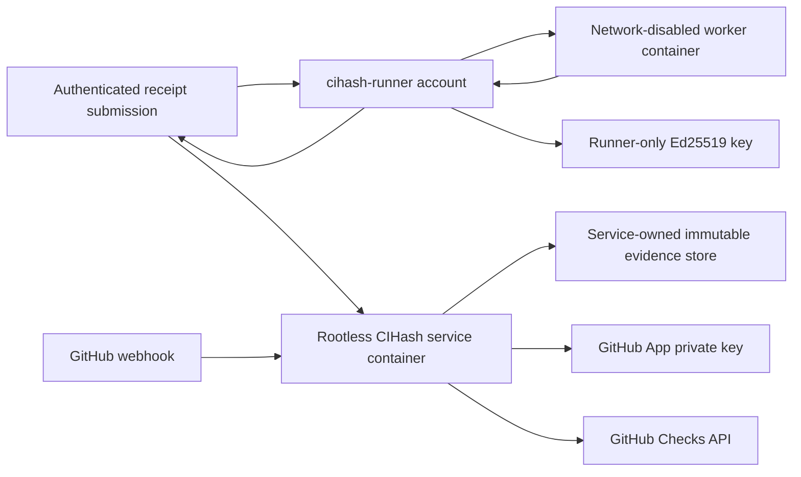

# T4 shadow deployment runbook

This deployment evaluates CIHash against one same-repository T4 pull request without changing any required check or fallback workflow.

## Deployed boundary

- Repository: `pilot-org/pilot-repo`
- GitHub App: `cihash-t4-shadow`, installed only on `pilot-repo`
- Public webhook: `https://cihash.wolfie.gg/webhooks/github`
- Check: `cihash/tooling-offline`
- Mode: `shadow`
- Runner host: administrator-controlled Linux host
- Worker: immutable Linux OCI image, no network, read-only root, bounded CPU, memory, PIDs, and writable `/work` tmpfs
- Proof scope: exact PR head plus current base merge tree

The exact checkout is mounted read-only at `/input`, copied into the bounded `/work` tmpfs, and executed there. The workload cannot modify the host checkout.

The proof profile runs this deterministic subset of T4's `tooling` job:

```text
scripts/check-adr-numbering.test.mjs
scripts/check-flutter-coverage.test.mjs
scripts/check-host-ownership.test.mjs
scripts/check-provenance.test.mjs
scripts/generate-release-manifest.test.mjs
scripts/test-temporary-directory.test.mjs
scripts/tailnet-service.test.mjs
```

The profile is deliberately named `tooling-offline`. It does not claim equivalence to T4's complete `pnpm test:tooling` job. Tests that install packages, query GitHub, inspect live release state, or depend on external services remain in ordinary CI.

## Trust separation



The two Unix identities have different privileges:

- `cihash-runner` owns the exact checkout, Docker access, worker image, and receipt signing key. The worker receives no Docker socket, signing key, GitHub credential, webhook secret, policy mount, or evidence-store mount. The runner submits signed evidence through the authenticated control-plane API.
- `cihash` runs the public webhook and receipt-ingestion service. Its container is read-only, capability-free, and has no Docker access. It owns only the immutable evidence store and replay/fallback state, and can read App credentials.

The service-owned store uses:

```text
/srv/cihash/receipts            0700 cihash:cihash
/srv/cihash/receipts/receipts   2750 cihash:cihash
receipt files                    0640 cihash:cihash
/srv/cihash/receipts/logs       0700 cihash:cihash
log files                        0600 cihash:cihash
/srv/cihash/receipts/identities 0700 cihash:cihash
/srv/cihash/receipts/runs       0700 cihash:cihash
```

## GitHub App configuration

Configure the App with:

- Webhook active at `https://cihash.wolfie.gg/webhooks/github`
- Repository permissions:
  - Actions: read and write
  - Contents: read-only
  - Checks: read and write
  - Pull requests: read-only
  - Metadata: read-only
- Events: Pull request and Workflow run
- Installation scope: only `pilot-org/pilot-repo`

Actions write permission exists only for enforce-mode fallback dispatch. Shadow mode does not dispatch fallback workflows. Store the App PEM and webhook secret outside the repository:

```text
/srv/cihash/secrets/github-app.pem
/srv/cihash/secrets/cihash.env
```

`cihash.env` supplies `CIHASH_GITHUB_CLIENT_ID`,
`CIHASH_GITHUB_PRIVATE_KEY_PATH`, `CIHASH_GITHUB_WEBHOOK_SECRET`, and a
random producer credential of at least 32 bytes in `CIHASH_PRODUCER_TOKEN`.
Provision the same credential at `/srv/cihash/runner-secrets/producer-token`
with mode `0400` and owner `cihash-runner`; never pass it on the command line,
print it, commit it, or expose it to a workload container.

## Build and deploy

Build the Linux service binary and immutable service image:

```bash
revision=$(git rev-parse HEAD)
test -z "$(git status --porcelain)"
CGO_ENABLED=0 GOOS=linux GOARCH=amd64 go build -buildvcs=true -trimpath -ldflags="-s -w -X github.com/wolfiesch/cihash/internal/hosted.buildSourceRevision=$revision -X github.com/wolfiesch/cihash/internal/hosted.buildSourceModified=false" -o /tmp/cihash-linux-amd64 ./cmd/cihash
scp /tmp/cihash-linux-amd64 deploy/t4-shadow/service.Dockerfile <runner-host>:/tmp/
ssh <runner-host> 'sudo install -o cihash -g cihash -m 0755 /tmp/cihash-linux-amd64 /srv/cihash/service-context/cihash && sudo install -o cihash -g cihash -m 0644 /tmp/service.Dockerfile /srv/cihash/service-context/Dockerfile && sudo docker build --tag cihash-service:shadow /srv/cihash/service-context'
```

Update `deploy/t4-shadow/cihash.service` with the resulting immutable image digest before installing the unit. Keep the service container on `agent-webhook-hub_web`; Caddy routes `cihash.wolfie.gg` to `cihash:18080` on that network.

The service root filesystem and config/secrets mounts remain read-only. The
receipt store is the narrow writable evidence mount because the authenticated
submission endpoint persists immutable receipts, private logs, run bindings,
and an atomic identity pointer. Keep it owned by the `cihash` service account;
do not expose it to the workload container.

Prepare the exact PR merge tree outside the checked-out T4 working tree, then build the worker image:

```bash
scp deploy/t4-shadow/worker.Dockerfile deploy/t4-shadow/worker.dockerignore deploy/t4-shadow/run-tooling.sh <runner-host>:/tmp/
ssh <runner-host> 'sudo install -d -o cihash-runner -g cihash-runner -m 0700 /srv/cihash/worker-pr112 && sudo install -o cihash-runner -g cihash-runner -m 0644 /tmp/worker.Dockerfile /srv/cihash/worker-pr112/worker.Dockerfile && sudo install -o cihash-runner -g cihash-runner -m 0644 /tmp/worker.dockerignore /srv/cihash/worker-pr112/.dockerignore && sudo install -o cihash-runner -g cihash-runner -m 0555 /tmp/run-tooling.sh /srv/cihash/worker-pr112/run-tooling.sh && rm -f /tmp/worker.Dockerfile /tmp/worker.dockerignore /tmp/run-tooling.sh'
sudo -u cihash-runner git -C /srv/cihash/worker-pr112/repository checkout --detach <head-sha>
sudo -u cihash-runner git -C /srv/cihash/worker-pr112/repository merge --no-commit --no-ff <base-sha>
sudo -u cihash-runner docker build --file /srv/cihash/worker-pr112/worker.Dockerfile --tag cihash-t4-tooling:shadow /srv/cihash/worker-pr112
sudo -u cihash-runner docker image inspect cihash-t4-tooling:shadow --format '{{.Id}}'
```

The worker build may access package registries while resolving the frozen lockfile. The signed workload cannot: `container-exec` requires an image digest and launches it with `--network none`, a read-only root, dropped capabilities, `no-new-privileges`, and resource limits.

Copy the resulting worker digest into `environment.image` in
`deploy/t4-shadow/policy.json`. Validate and deploy the manifests:

```bash
go run ./cmd/cihash policy --file deploy/t4-shadow/policy.json
scp deploy/t4-shadow/policy.json deploy/t4-shadow/hosted.json deploy/t4-shadow/cihash.service <runner-host>:/tmp/
ssh <runner-host> 'sudo install -o cihash -g cihash -m 0644 /tmp/policy.json /srv/cihash/config/policy.json && sudo install -o cihash -g cihash -m 0644 /tmp/hosted.json /srv/cihash/config/hosted.json && sudo install -o root -g root -m 0644 /tmp/cihash.service /etc/systemd/system/cihash.service && sudo systemctl daemon-reload && sudo systemctl enable --now cihash.service'
```

## Generate and verify a proof

The runner requests a server-issued grant for the current pull request, independently resolves the granted commits and merge tree, executes the pinned policy command, signs the result, and submits the receipt and raw log through the authenticated ingestion endpoint:

```bash
ssh <runner-host> 'sudo -u cihash-runner /srv/cihash/bin/cihash hosted-run --server https://cihash.wolfie.gg --token-file /srv/cihash/runner-secrets/producer-token --installation <installation-id> --pull-request <pr-number> --repo /srv/cihash/repository --private-key /srv/cihash/runner-secrets/receipt-signing.pem'
```

The service re-verifies the signature, server nonce, exact head, base, GitHub merge tree, policy, workflow, environment, architecture, timing, complete job set, and uploaded log digest before immutable persistence. A failed workload may submit a signed diagnostic receipt, but it cannot authorize a success check. An altered binding or an unissued, expired, replayed, or conflicting run returns a nonzero status.

## Shadow evaluation

A valid GitHub `pull_request` delivery causes the service to fetch the current PR from GitHub rather than trusting the webhook's head/base fields. It then verifies the receipt against current GitHub state and creates the App-authored check.

Expected accepted output:

```text
name: cihash/tooling-offline
status: completed
conclusion: success
title: CIHash proof accepted
summary: proof matches the required code, policy, workflow, and environment
```

Missing or invalid proof in shadow mode produces a neutral diagnostic check. It never produces success and never dispatches fallback. Replayed `X-GitHub-Delivery` values are deduplicated in `/srv/cihash/state`.

The App correlates that proof decision with the exact `tooling` job from the
configured `CI` workflow. It obtains the job conclusion and timestamps through
the installation-scoped GitHub API rather than inferring them from the aggregate
workflow result. Generate the machine-readable pilot report on the host:

```bash
sudo -u cihash /srv/cihash/bin/cihash lab shadow-report --state-directory /srv/cihash/state
```

The command exits nonzero until at least one comparable observation exists, all
comparable proof decisions match the selected Actions job, no correlation is
pending, and every comparable observation identifies an unmodified production
service build by source revision and binary digest. A proof is comparable only
when CIHash accepted it or rejected it because the signed run failed; missing,
stale, malformed, and unsupported proofs remain visible but are classified as
`not_comparable`.

## Verified demonstration

PR [pilot-org/pilot-repo#123](https://github.com/pilot-org/pilot-repo/pull/123) was evaluated at:

- Head: `7f83b64c1d35b63be0f74afca319a98819bb8341`
- Base: `210ddfcb11b84da89b2c4b079a9517901168fa37`
- Tested merge tree: `855ef8ce3c9b35a9d0957d4aa20f6b5366fba6bb`
- Worker image: `sha256:8fdc397e0dfa64f1418aae9d707d5d093e0ffc695a360913434761f642a152e3`
- Policy digest: `sha256:509e2470dd07344a0797bf44737ed449c37622738ecd7b78b1b2253dd2ac4bf5`
- Workflow digest: `sha256:48e5659326d60fabc9ae465c42c4156078117138607b7942482b68f860b7b54d`
- Environment digest: `sha256:88bf3eb953c2159b8b67b936eea27f1fd524fae4113427f62aba02706e9334bd`
- Receipt digest: `sha256:31ef79c1903416eff809ea9d61e92556ae999fdc37796c80d4428bdf49bbb3bd`
- Hosted service source: `e4dc94e75b735ae4fe84628ea130bb017563803f`, unmodified production build
- Ordinary T4 tooling job, run attempt 1: [success](https://github.com/pilot-org/pilot-repo/actions/runs/29822256625/job/88607416689)
- CIHash App check: [success](https://github.com/pilot-org/pilot-repo/runs/88609660965)
- Shadow parity report: one comparable match, zero pending, zero mismatches

The CIHash profile covers only the offline subset listed above, so these results establish agreement for that subset and the proof/check round trip. They do not establish a performance comparison or full `tooling` job equivalence.

## Enforce-mode gate

Do not make `cihash/tooling-offline` required yet. Before switching `hosted.json` to `enforce`:

1. Run repeated shadow evaluations across new T4 commits and record every rejection code.
2. Exercise workflow dispatch in a sandbox repository and prove fallback completion updates the same App check correctly.
3. Prove key rotation, receipt expiry, base movement, App uninstall, API errors, webhook replay, and state-store recovery fail closed.
4. Keep the App installed on one repository and require the App-authored check source explicitly.
5. Preserve ordinary CI as fallback for every missing, stale, malformed, or unsupported proof.

Rollback is `sudo systemctl stop cihash.service`. This removes only the experimental App check publisher; T4's existing Actions workflows and required checks remain unchanged.
