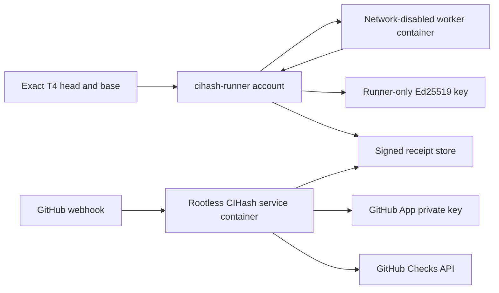

# T4 shadow deployment runbook

This deployment evaluates CIHash against one same-repository T4 pull request without changing any required check or fallback workflow.

## Deployed boundary

- Repository: `pilot-org/pilot-repo`
- GitHub App: `cihash-t4-shadow`, installed only on `pilot-repo`
- Public webhook: `https://cihash.wolfie.gg/webhooks/github`
- Check: `cihash/tooling-offline`
- Mode: `shadow`
- Runner host: administrator-controlled Linux host
- Worker: immutable Linux OCI image, no network, read-only root, bounded CPU, memory, PIDs, and writable `/work` tmpfs
- Proof scope: exact PR head plus current base merge tree

The exact checkout is mounted read-only at `/input`, copied into the bounded `/work` tmpfs, and executed there. The workload cannot modify the host checkout.

The proof profile runs this deterministic subset of T4's `tooling` job:

```text
scripts/check-adr-numbering.test.mjs
scripts/check-flutter-coverage.test.mjs
scripts/check-host-ownership.test.mjs
scripts/check-provenance.test.mjs
scripts/generate-release-manifest.test.mjs
scripts/test-temporary-directory.test.mjs
scripts/tailnet-service.test.mjs
```

The profile is deliberately named `tooling-offline`. It does not claim equivalence to T4's complete `pnpm test:tooling` job. Tests that install packages, query GitHub, inspect live release state, or depend on external services remain in ordinary CI.

## Trust separation



The two Unix identities have different privileges:

- `cihash-runner` owns the exact checkout, Docker access, worker image, and receipt signing key. The worker receives no Docker socket, signing key, GitHub credential, webhook secret, policy mount, or receipt-store mount.
- `cihash` runs the public webhook service. Its container is read-only, capability-free, and has no Docker access. It can read signed receipts and App credentials, and can write only replay/fallback state.

Signed receipts are group-readable evidence. Raw job logs remain readable only by `cihash-runner`. The shared store uses:

```text
/srv/cihash/receipts            2770 cihash-runner:cihash
/srv/cihash/receipts/receipts   2750 cihash-runner:cihash
receipt files                    0640 cihash-runner:cihash
/srv/cihash/receipts/logs       2700 cihash-runner:cihash
log files                        0600 cihash-runner:cihash
```

## GitHub App configuration

Configure the App with:

- Webhook active at `https://cihash.wolfie.gg/webhooks/github`
- Repository permissions:
  - Actions: read and write
  - Checks: read and write
  - Pull requests: read-only
  - Metadata: read-only
- Events: Pull request and Workflow run
- Installation scope: only `pilot-org/pilot-repo`

Actions write permission exists only for enforce-mode fallback dispatch. Shadow mode does not dispatch fallback workflows. Store the App PEM and webhook secret outside the repository:

```text
/srv/cihash/secrets/github-app.pem
/srv/cihash/secrets/cihash.env
```

`cihash.env` supplies `CIHASH_GITHUB_APP_ID`, `CIHASH_GITHUB_CLIENT_ID`, `CIHASH_GITHUB_PRIVATE_KEY_PATH`, and `CIHASH_GITHUB_WEBHOOK_SECRET`. Never print or commit their values.

## Build and deploy

Build the Linux service binary and immutable service image:

```bash
CGO_ENABLED=0 GOOS=linux GOARCH=amd64 go build -trimpath -ldflags='-s -w' -o /tmp/cihash-linux-amd64 ./cmd/cihash
scp /tmp/cihash-linux-amd64 deploy/t4-shadow/service.Dockerfile <runner-host>:/tmp/
ssh <runner-host> 'sudo install -o cihash -g cihash -m 0755 /tmp/cihash-linux-amd64 /srv/cihash/service-context/cihash && sudo install -o cihash -g cihash -m 0644 /tmp/service.Dockerfile /srv/cihash/service-context/Dockerfile && sudo docker build --tag cihash-service:shadow /srv/cihash/service-context'
```

Update `deploy/t4-shadow/cihash.service` with the resulting immutable image digest before installing the unit. Keep the service container on `agent-webhook-hub_web`; Caddy routes `cihash.wolfie.gg` to `cihash:18080` on that network.

Prepare the exact PR merge tree outside the checked-out T4 working tree, then build the worker image:

```bash
scp deploy/t4-shadow/worker.Dockerfile deploy/t4-shadow/worker.dockerignore deploy/t4-shadow/run-tooling.sh <runner-host>:/tmp/
ssh <runner-host> 'sudo install -d -o cihash-runner -g cihash-runner -m 0700 /srv/cihash/worker-pr112 && sudo install -o cihash-runner -g cihash-runner -m 0644 /tmp/worker.Dockerfile /srv/cihash/worker-pr112/worker.Dockerfile && sudo install -o cihash-runner -g cihash-runner -m 0644 /tmp/worker.dockerignore /srv/cihash/worker-pr112/.dockerignore && sudo install -o cihash-runner -g cihash-runner -m 0555 /tmp/run-tooling.sh /srv/cihash/worker-pr112/run-tooling.sh && rm -f /tmp/worker.Dockerfile /tmp/worker.dockerignore /tmp/run-tooling.sh'
sudo -u cihash-runner git -C /srv/cihash/worker-pr112/repository checkout --detach <head-sha>
sudo -u cihash-runner git -C /srv/cihash/worker-pr112/repository merge --no-commit --no-ff <base-sha>
sudo -u cihash-runner docker build --file /srv/cihash/worker-pr112/worker.Dockerfile --tag cihash-t4-tooling:shadow /srv/cihash/worker-pr112
sudo -u cihash-runner docker image inspect cihash-t4-tooling:shadow --format '{{.Id}}'
```

The worker build may access package registries while resolving the frozen lockfile. The signed workload cannot: `container-exec` requires an image digest and launches it with `--network none`, a read-only root, dropped capabilities, `no-new-privileges`, and resource limits.

Copy the resulting worker digest into both `command[].--image` and `environment` in `deploy/t4-shadow/policy.json`. Validate and deploy the manifests:

```bash
go run ./cmd/cihash policy --file deploy/t4-shadow/policy.json
scp deploy/t4-shadow/policy.json deploy/t4-shadow/hosted.json deploy/t4-shadow/cihash.service <runner-host>:/tmp/
ssh <runner-host> 'sudo install -o cihash -g cihash -m 0644 /tmp/policy.json /srv/cihash/config/policy.json && sudo install -o cihash -g cihash -m 0644 /tmp/hosted.json /srv/cihash/config/hosted.json && sudo install -o root -g root -m 0644 /tmp/cihash.service /etc/systemd/system/cihash.service && sudo systemctl daemon-reload && sudo systemctl enable --now cihash.service'
```

## Generate and verify a proof

The runner resolves the supplied commits, constructs the merge tree itself, executes the pinned policy command, signs the result, and stores the raw log separately:

```bash
ssh <runner-host> 'sudo -u cihash-runner /srv/cihash/bin/cihash run --repo /srv/cihash/repository --head <head-sha> --base <base-sha> --policy /srv/cihash/config/policy.json --private-key /srv/cihash/runner-secrets/receipt-signing.pem --store /srv/cihash/receipts'
```

Verify the returned receipt with its nonce before publication:

```bash
ssh <runner-host> 'sudo -u cihash-runner /srv/cihash/bin/cihash verify --receipt <receipt-path> --policy /srv/cihash/config/policy.json --public-key /srv/cihash/runner-secrets/receipt-signing.pub.pem --head <head-sha> --base <base-sha> --nonce <nonce>'
```

An altered head, base, policy, workflow, environment, required job set, signature, nonce, or expiry must return a specific rejection and a nonzero exit status.

## Shadow evaluation

A valid GitHub `pull_request` delivery causes the service to fetch the current PR from GitHub rather than trusting the webhook's head/base fields. It then verifies the receipt against current GitHub state and creates the App-authored check.

Expected accepted output:

```text
name: cihash/tooling-offline
status: completed
conclusion: success
title: CIHash proof accepted
summary: proof matches the required code, policy, workflow, and environment
```

Missing or invalid proof in shadow mode produces a neutral diagnostic check. It never produces success and never dispatches fallback. Replayed `X-GitHub-Delivery` values are deduplicated in `/srv/cihash/state`.

## Verified demonstration

PR [pilot-org/pilot-repo#112](https://github.com/pilot-org/pilot-repo/pull/112) was evaluated at:

- Head: `8e41d90b062c68a6745ef0d8a74cf24efa5d9937`
- Base: `1b4690684066de85f23ef6748c9900596be1f5e8`
- Tested merge tree: `9eff27c9101c96e9ad5f249fcc8dd05c94992c12`
- Worker image: `sha256:8fdc397e0dfa64f1418aae9d707d5d093e0ffc695a360913434761f642a152e3`
- Policy digest: `sha256:9f620596f58f012b6b4f020df2474a038fc72d78116b03ab0746b76b03591d24`
- Workflow digest: `sha256:09588c4b68e7c19fa3bfaebc18171cff90fc0110b4c36212f99edecd56f1b95f`
- Environment digest: `sha256:33c68dc1b37225c4b716f86176bbd4ef55a5ac3fbe7bab3ccb3732928fac30ac`
- Ordinary T4 tooling job: [success](https://github.com/pilot-org/pilot-repo/actions/runs/29802654038/job/88546592164)
- CIHash App check: [success](https://github.com/pilot-org/pilot-repo/runs/88569144819)

The CIHash profile covers only the offline subset listed above, so these results establish agreement for that subset and the proof/check round trip. They do not establish a performance comparison or full `tooling` job equivalence.

## Enforce-mode gate

Do not make `cihash/tooling-offline` required yet. Before switching `hosted.json` to `enforce`:

1. Run repeated shadow evaluations across new T4 commits and record every rejection code.
2. Exercise workflow dispatch in a sandbox repository and prove fallback completion updates the same App check correctly.
3. Prove key rotation, receipt expiry, base movement, App uninstall, API errors, webhook replay, and state-store recovery fail closed.
4. Keep the App installed on one repository and require the App-authored check source explicitly.
5. Preserve ordinary CI as fallback for every missing, stale, malformed, or unsupported proof.

Rollback is `sudo systemctl stop cihash.service`. This removes only the experimental App check publisher; T4's existing Actions workflows and required checks remain unchanged.
